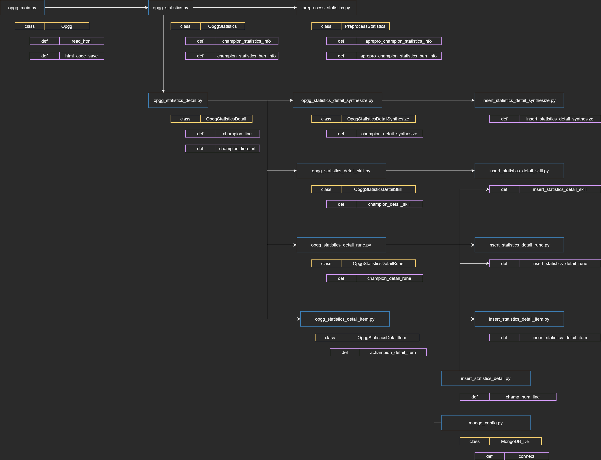

# Python 크롤링 구조도

python 폴더의 source는 [OPGG](https://www.op.gg/) 웹 사이트를 크롤링 하기위해 만들어 졌습니다.

사용 라이브 러리

```python
requests
beautifulsoup4
mysql-connector-python
mysql-connector-python-rf
mysqlclient
pymongo
```

폴더 구조

```python
│  Pipfile
│  __init__.py
│
├─crawling # OP.GG 크롤링 연결 class
│      opgg_main.py
│      opgg_statistics.py
│      opgg_statistics_detail.py
│      opgg_statistics_detail_item.py
│      opgg_statistics_detail_rune.py
│      opgg_statistics_detail_skill.py
│      opgg_statistics_detail_synthesize.py
│      __init__.py
│
├─DB
│  │  __init__.py
│  │
│  ├─Mongo 
│  │  │   # Mongo DB 연결 class
│  │  │  mongo_config.p
│  │  │  __init__.py
│  │  │
│  │  │ # Mongo DB 데이터
│  │  │ # insert func
│  │  └─insert
│  │    insert_champion_info.py
│  │    insert_item_info.py
│  │    insert_rune_info.py
│  │    insert_statistics.py
│  │    insert_statistics_detail.py
│  │    insert_statistics_detail_item.py
│  │    insert_statistics_detail_rune.py
│  │    insert_statistics_detail_skill.py
│  │    insert_statistics_detail_synthesize.py
│  │    __init__.py
│  │
│  ├─MySQL # MySQL DB 연결 class
│  │   mysql_config.py
│  │   __init__.py
│  │ 
│  │
│  └─PreprocessData
│          # 크롤링 DB insert전 Data 처리
│          preprocess_statistics.py
│          __init__.py
│
└─log
    # log 처리
    example.log
    log.py # 로그 호출 class
    __init__.py
```

소스 작동 프로세스


